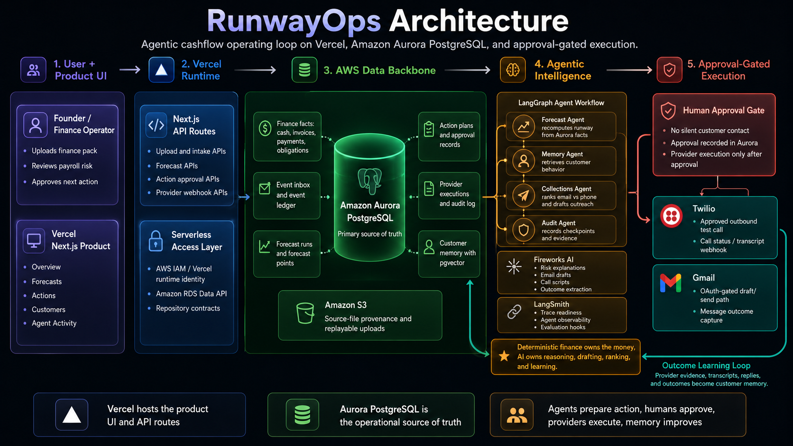

# RunwayOps

**RunwayOps is an agentic cashflow operating system for SMB founders and finance
operators. It turns invoices, obligations, customer behavior, and follow-up
history into runway forecasts, ranked recovery actions, human-approved
execution, and learned customer memory.**

Built for the H0 Hackathon on **Vercel** and **Amazon Aurora PostgreSQL**.

## Live Demo

- Product: <https://agentic-cashflow-management.vercel.app>
- Source: <https://github.com/AbhinavGupta707/Agentic-Cashflow-Management>
- Primary AWS database: **Amazon Aurora PostgreSQL**
- Vercel project: `agentic-cashflow-management`

## Architecture



RunwayOps is designed as an operating loop rather than a passive dashboard:

```text
Financial evidence
-> Aurora-backed source of truth
-> deterministic forecast
-> customer memory
-> ranked recovery plan
-> tailored outreach
-> human approval
-> provider execution
-> audit trail
-> learned memory
-> better next action
```

## What It Does

RunwayOps helps a small business finance team:

1. Upload or refresh cashflow evidence.
2. Store source provenance and normalized operating state.
3. Forecast cash pressure and payroll risk from deterministic financial facts.
4. Retrieve customer behavior memory.
5. Rank receivables recovery actions by cash impact, timing, and likelihood.
6. Generate tailored email drafts or call scripts.
7. Require human approval before outbound action.
8. Record provider execution evidence and outcomes.
9. Convert outcomes into customer memory for the next recommendation.

The user-facing product is intentionally simple: current risk, forecast
pressure, recommended action, approval queue, customer memory, and agent
activity. The backend carries the richer operating model.

## Demo Walkthrough

Judges can use the deployed product without local setup:

1. Open the live app at <https://agentic-cashflow-management.vercel.app>.
2. Start on **Overview** to see the Marlow & Finch payroll-risk case, current
   cash pressure, recoverable cash, and recommended actions.
3. Open **Forecasts** to inspect deterministic runway scenarios calculated from
   Aurora-backed financial facts.
4. Open **Actions** and select a customer action such as Ember Lane or Northstar
   to review the agent rationale, customer memory, draft/call script, approval
   controls, and provider readiness.
5. Approve an action to see the approval-gated execution flow.
6. Open **Agent Activity** to see finance import evidence, forecast
   recomputation, recommendation ranking, draft generation, approval records,
   provider readiness, and memory updates.

## Why It Is Agentic

RunwayOps is not a chatbot on top of a dashboard. It separates financial truth
from agentic judgment:

| Layer | Responsibility |
| --- | --- |
| Deterministic finance | Cash balances, obligations, invoice timing, low points, runway, scenario math |
| Aurora PostgreSQL | Source of truth for finance state, approvals, provider state, memory, audit |
| LangGraph agents | Forecast, memory retrieval, collections planning, audit checkpoints |
| Fireworks AI | Risk explanations, outreach drafts, call scripts, outcome extraction |
| Human approval | Required before outbound customer contact |
| Provider layer | Twilio/Gmail execution surfaces with provider evidence and guardrails |

The model prepares and explains action. Aurora carries the money, approval,
provider, audit, and memory state.

## Technical Architecture

| Component | What It Does | Why It Matters |
| --- | --- | --- |
| Vercel + Next.js | Hosts the public product UI and API route runtime | Full-stack deployed product, not a static front end |
| React + Tailwind CSS | Premium cockpit for Overview, Forecasts, Actions, Customers, Agent Activity | Makes complex finance operations understandable to a founder |
| Next.js API routes | Product overview, action detail, approvals, draft editing, scenarios, customers, agent activity, intake, uploads, voice status, TwiML, webhooks | Keeps product state and workflow behind explicit backend contracts |
| Amazon Aurora PostgreSQL | Primary operational database for finance facts, forecasts, actions, approvals, providers, memory, checkpoints, and audit | Satisfies the H0 AWS Database requirement and makes state durable |
| Amazon RDS Data API | Serverless SQL access from Vercel to Aurora | Avoids long-lived database connections in the web runtime |
| Amazon S3 | Source-file provenance for uploaded finance packs | Makes intake auditable and replayable |
| LangGraph | Durable agent orchestration and checkpoints | Makes the agent workflow inspectable and resumable |
| Fireworks AI | Structured recommendations, draft generation, call scripts, explanations, extraction | Makes AI useful without letting it invent financial totals |
| LangSmith | Trace readiness and observability hooks | Supports evaluation and debugging of agent behavior |
| Twilio | Approval-gated live test-call path and voice execution state | Demonstrates insight becoming controlled provider action |
| Gmail OAuth foundation | Approval-gated draft/send surface and communication outcome model | Extends the same safety model to email |

## AWS Database Usage

The database used for the H0 requirement is **Amazon Aurora PostgreSQL**.

It is not Aurora DSQL and it is not DynamoDB.

Aurora stores the complete operating model:

- companies, users, cash accounts, customers, and contacts
- invoices, obligations, payments, and source files
- event inbox rows and event ledger rows
- forecast runs and forecast points
- action plans, recommended actions, and approval records
- communication drafts, provider executions, voice calls, and transcripts
- customer memory chunks, including pgvector-ready memory primitives
- agent runs, agent checkpoints, trace metadata, and audit logs

The Vercel runtime talks to Aurora through the Amazon RDS Data API, which keeps
the serverless deployment model compatible with a production-grade relational
backend.

## Safety Model

Cashflow automation is high stakes, so RunwayOps is deliberately bounded:

- The LLM does not invent financial totals.
- Forecasting and scenario math are deterministic.
- Outbound actions require approval.
- Provider IDs and outcomes are shown only when backed by provider evidence.
- Twilio live calls are gated by approval, live flags, credentials, and a
  configured test destination.
- Gmail is OAuth/connection-gated.
- Secrets belong in `.env.local` locally and Vercel environment variables in
  production, never in Git.

## Tech Stack

- **Frontend:** Next.js 15, React 19, TypeScript, Tailwind CSS, lucide-react
- **Deployment:** Vercel
- **AWS:** Aurora PostgreSQL, Amazon RDS Data API, Amazon S3, AWS IAM/OIDC
- **Agents:** LangGraph, Fireworks AI, LangSmith readiness
- **Providers:** Twilio voice path, Gmail OAuth foundation
- **Validation and tooling:** Zod, TSX scripts, contract checks, no-key smoke
  tests

## Local Development

Clone only the canonical repository:

```bash
git clone https://github.com/AbhinavGupta707/Agentic-Cashflow-Management.git
cd Agentic-Cashflow-Management
cp .env.example .env.local
npm install
npm run dev
```

The local app loads `.env.local`. Keep secrets out of Git.

Useful local commands:

```bash
npm run typecheck
npm run build
npm run db:migrate:dry
npm run db:seed:dry
npm run smoke:product:no-key
```

Live Aurora migration, seed, and smoke commands require AWS/Aurora Data API
environment variables. Without the relevant credentials, scripts should report
clear unavailable/no-key states rather than fake success.

## Verification

The repository includes checkpoint contract and smoke scripts for the major
runtime surfaces:

```bash
npm run check:cp2
npm run check:cp3
npm run check:cp4
npm run check:cp5
npm run check:cp6
npm run check:cp7
npm run check:cp8
npm run smoke:gmail:no-key
npm run smoke:voice:no-key
npm run smoke:cp8:intake:no-key
```

For final product readiness:

```bash
CP8_REQUIRE_FINAL_PRODUCT=true npm run check:cp8
```

## Submission Assets

- Devpost draft: [`docs/devpost-submission-draft.md`](docs/devpost-submission-draft.md)
- Final submission package: [`docs/h0-final-submission-package.md`](docs/h0-final-submission-package.md)
- Architecture source doc: [`docs/h0-architecture-diagram.md`](docs/h0-architecture-diagram.md)
- Uploadable architecture image:
  [`docs/submission-assets/runwayops-architecture-devpost.png`](docs/submission-assets/runwayops-architecture-devpost.png)
- Editable SVG architecture:
  [`docs/submission-assets/runwayops-architecture.svg`](docs/submission-assets/runwayops-architecture.svg)
- Demo runbook: [`docs/live-demo-runbook.md`](docs/live-demo-runbook.md)

## Implementation History

The project was built in checkpointed slices:

- **Checkpoint 0:** canonical repo setup and orchestration plan.
- **Checkpoint 1:** Next.js cockpit shell, Aurora schema, migration/seed path,
  RDS Data API client, and first smoke checks.
- **Checkpoint 2:** live upload/manual ingestion, S3 source storage, Aurora
  provenance, event inbox processing, and no-key/live smoke verification.
- **Checkpoint 3:** deterministic forecasting from Aurora facts, LangGraph
  persisted runs/checkpoints, Fireworks readiness, LangSmith trace posture, and
  approval-ready handoff.
- **Checkpoint 4:** approval-gated Gmail/provider contracts and communication
  outcome model.
- **Checkpoint 5/6:** voice/provider readiness, product API routes, and core
  product UI surfaces.
- **Checkpoint 7:** live demo workflow, Fireworks-backed previews, approval
  interaction polish, and Agent Activity evidence.
- **Checkpoint 8:** final product pass with live intake loop, execution/memory
  polish, final QA, architecture assets, and submission package.

Detailed checkpoint docs live under [`docs/`](docs/).
