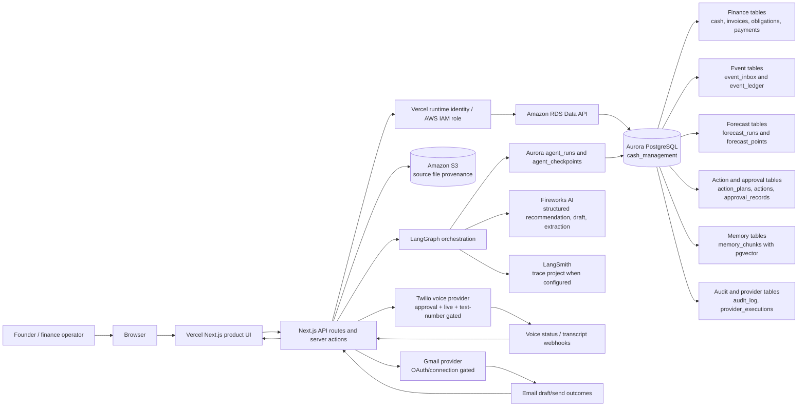

# H0 Architecture Diagram

Date: 2026-06-29

Purpose: submission-safe architecture proof for H0 judging. This diagram shows
how the Vercel application connects to the AWS database, source storage, agent
runtime, and gated provider execution.

## Data Flow

1. A user uploads a finance pack or enters manual records through the Vercel UI.
2. The API stores raw file provenance in S3 and normalized source/event state in
   Aurora PostgreSQL through the RDS Data API.
3. The event inbox drives deterministic normalization, forecast, and action
   planning steps.
4. The forecast engine computes cash, runway, low points, and scenario math from
   Aurora facts. The LLM never invents financial totals.
5. LangGraph persists orchestration state into `agent_runs` and
   `agent_checkpoints`.
6. Fireworks generates structured recommendations, email drafts, call scripts,
   explanations, and outcome/memory extraction when configured.
7. Human approval is stored in Aurora before any outbound action.
8. Twilio/Gmail providers execute only when configured, explicitly approved, and
   allowed by provider-specific gates.
9. Real provider IDs, webhooks, transcripts, and outcomes write back to Aurora
   provider, communication, voice, memory, and audit tables.

## H0 Requirement Mapping

| Requirement | Evidence |
| --- | --- |
| Full-stack app | Vercel Next.js UI plus API routes/server actions |
| AWS Database | Aurora PostgreSQL is the operational source of truth |
| Vercel deployment | Public product URL and Vercel Project/Team IDs in submission docs |
| Back-end architecture | RDS Data API, S3 provenance, LangGraph checkpoints, provider logs |
| Submission proof | Use this diagram plus AWS console screenshot of the Aurora cluster |

## Safety Notes

- This diagram intentionally omits secrets, tokens, and raw ARNs.
- Provider execution is not represented as automatic. It is approval-gated and
  records real provider IDs only after a provider returns them.
- Gmail is optional/OAuth-gated. Twilio is the preferred live demo path because
  it can be limited to `TWILIO_TEST_TO_NUMBER`.
